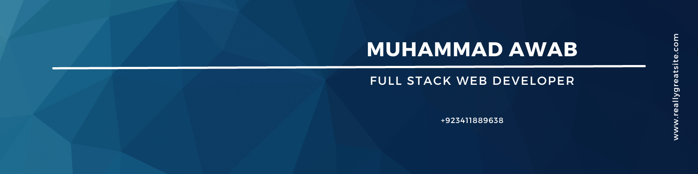

<h1 align="center">Hi 👋, I'm Muhammad Awab Ahmed</h1>
<h3 align="center">A passionate Full Stack Developer</h3>

  

  

- 🔭 I’m currently working on [Cyberoide](https://www.cyberoide.tech/)

- 🌱 I’m currently learning **DevSecops**

- 👯 I’m looking to collaborate on **My Personal Projects**

- 🤝 I’m looking for help with **My projects**

- 👨‍💻 All of my projects are available at [https://awabportfolio.netlify.app/](https://awabportfolio.netlify.app/)

- 💬 Ask me about **C# , Asp.Net , React , Firebase , Sql**

- 📫 How to reach me **https://awabportfolio.netlify.app/**

- 📄 Know about my experiences [https://www.linkedin.com/in/muhammadawab/](https://www.linkedin.com/in/muhammadawab/)

<h3 align="left">Connect with me:</h3>

<h3 align="left">Languages and Tools:</h3>

                             

&nbsp;

